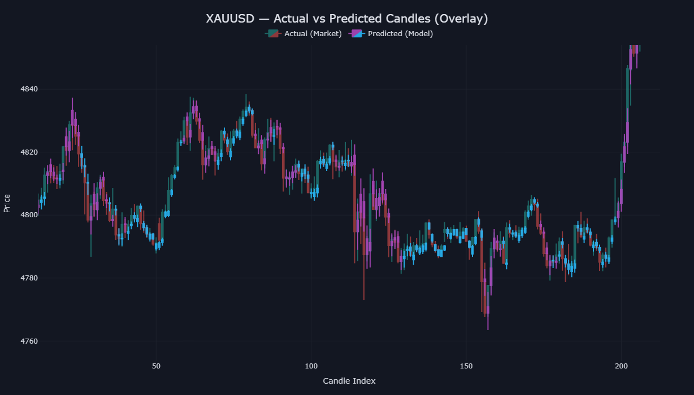
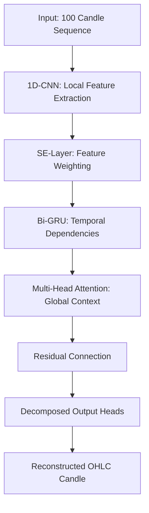

# Forex Market Forecaster

This project provides a deep learning pipeline designed to predict intraday Forex candle components (OHLC) on M15 timeframe. It utilizes a hybrid CNN-GRU architecture integrated with both feature-level and temporal attention mechanisms.


*Sample output for XAUUSD on M15: Predicted (purple/blue) vs actual (green/red) candlesticks.*

---

## Project Overview

The forecaster is designed to be asset-agnostic, capable of modeling any financial instrument—including Forex pairs, commodities, or indices—by decomposing individual candles into four orthogonal components: Close Return, Open Gap, High Extension, and Low Extension. This decomposition helps stabilize training and improves the reconstruction of absolute price levels compared to predicting raw price values.

### Technical Highlights

*   **Component Decomposition**: Independent prediction of candle parts to resolve scaling issues and improve direction accuracy.
*   **Hybrid Model Logic**: Uses a 1D-CNN front-end to identify local geometric patterns in price action, followed by a Bi-Directional GRU to capture longer-term temporal dependencies.
*   **Dual Attention**:
    *   **Feature Attention (SE-Layer)**: Dynamically weights input features to prioritize high-signal technical indicators.
    *   **Temporal Attention (Multi-Head)**: Refines the model's focus across the 100-candle lookback window.
*   **Robust Training**: Implements a custom loss function that balances mean squared error with directional accuracy and variance penalties to prevent the model from converging to a mean value.

---

## Technical Stack

*   **Runtime**: Python 3.x
*   **Deep Learning**: PyTorch
*   **Data Processing**: Pandas, NumPy, Scikit-Learn
*   **Technical Analysis**: `ta` library
*   **Visualization**: Plotly

---

## Feature Engineering

The model processes over 60 calculated features, including:

*   **Price Action**: Normalized OHLC returns and scale-free ratios for candle bodies and wicks.
*   **Momentum Indicators**: RSI, Stochastic Oscillators, and MACD Histogram.
*   **Volatility Metrics**: Bollinger Band position and ATR (Average True Range) as a percentage of price.
*   **Volume Analysis**: Z-scores, volume-price correlation, OBV (On Balance Volume) momentum, and VWAP relative positioning.
*   **Time Encoding**: Sine and cosine transformations for hour-of-day and day-of-week to capture market session cyclicality.
*   **Historical Context**: Lagged returns and momentum values to provide direct historical state.

---

## Model Architecture

The data flows through the following stages:



---

## Setup and Usage

### 1. Installation
Install the necessary dependencies via pip:

```bash
pip install numpy pandas torch scikit-learn ta plotly joblib
```

### 2. Execution
Run the main script to start the pipeline. The script handles data acquisition, feature generation, model training, and evaluation:

```bash
python main.py
```

The process will output a trained model (`ohlc_model.pth`), saved scalers, and an interactive Plotly chart.

---

## Evaluation

The model's performance is measured using MAE, RMSE, and MAPE for each candle component. Additionally, it tracks direction accuracy for both the candle itself (bullish vs. bearish) and the price movement relative to the previous close.

---

## Disclaimer
Financial trading involves significant risk. This project is intended for research and educational purposes. The results provided by this model should not be considered financial advice.
